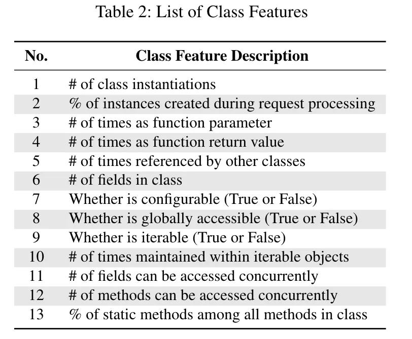
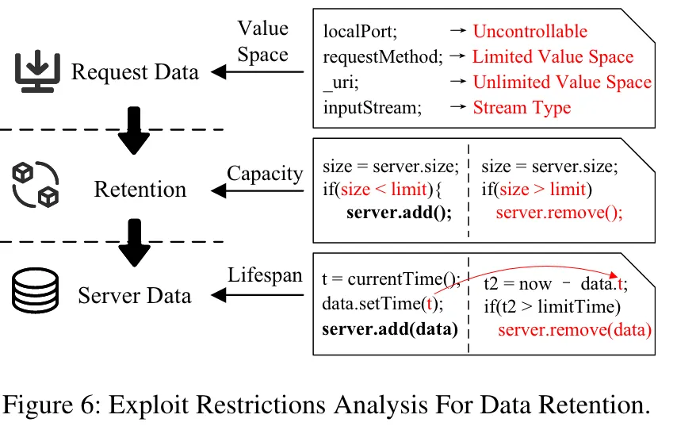

# Careless Retention and Management: Understanding and Detecting Data Retention Denial-of-Service Vulnerabilities in Java Web Containers
## 论文信息
+ 论文作者：（复旦白泽）Lian Keke; Zhang Lei; Zhao Haoran; Cao Yinzhi; Liu Yongheng; Sun Fute; Zhang Yuan; Yang Min
+ 发表时间：2025
+ 发表期刊/会议：USENIX
+ 阅读时间：2025.09.01

## 论文内容简述
文章关注DRDOS——数据保留DOS，即用户的输入被保留在长期存活不会被垃圾回收机制回收的对象中，通过多次触发，在内存中生成大量垃圾对象，最终实现对目标服务耗尽内存的攻击。

## 论文创新核心
+ 提出并系统地分析了java web容器中存在的DRDOS问题，描述了这种攻击的可能性。
+ 开发了DR.D静态分析模型，实现对具有DRDOS漏洞的web容器的检测。
+ 发现了28个0day漏洞并全部被开发者承认。

## 论文重点部分记录
为检测DRDOS漏洞，文中提出了DR.D模型，其结构图如下：

该模型将原任务分为三部分：

1. 从原始代码中定位出web请求处理程序。
2. 发现java代码中可能长期存在的类或变量。
3. 检测和验证漏洞存在。

### 1、如何定位web容器的请求处理程序？
通过自动识别容器特定的请求类并对请求数据操作方式进行聚类来定位请求处理程序。为了解决这个问题，提出了一种请求数据驱动的方法，首先通过识别代表请求数据的容器特定类，然后通过分析请求数据操纵方法之间的关系来定位请求处理程序。

作者认为不论java的web容器种类如何，都是需要满足servlet标准的，即实现相关接口或继承相关类，如上表所示。作者认为满足这些条件的类可以被认为是和web请求处理强相关的，而进一步继承这些类的子类都可以被判断为实际发挥作用的web请求处理接口。在识别出所有请求类后，DR . D通过提取带有请求类类型参数的方法来检测请求数据操纵方法。除了利用已识别的请求类，DR . D还考虑了包含请求类类型字段的包装类。

进一步的一个关键见解是，尽管在命名和功能上存在差异，但请求处理程序在灵活可配置的设计模式中表现出共同的特征。为了实现灵活的配置和统一的调用，每个集群中的方法通常遵循相同的规范，例如实现或覆盖相同的方法。此外，这些集群的组织和管理遵循共同的设计模式，如上图所示的例子。在集中管理中，请求处理程序存储在一个基于开发者配置的队列中，管理器依次调用每个处理程序( (例如, doFilter () )。在分散式管理中，下一个处理程序通过其字段显式地配置在当前处理程序中，从而调用后续处理程序。

基于这些特点，DR . D通过对请求数据操作方式进行聚类来定位请求处理程序。DR . D首先对共享同一个子签名(相同的函数名称、参数和返回值)的方法进行分组。然后，对于每个组，DR . D分析其调用关系。如果这些方法缺乏直接的调用，但共享同一个调用者，这也是他们的共同被调用者，它们被确定为使用集中管理。如果这些方法之间存在直接的相互调用，则被判断为分散式管理。

### 2、如何确定长寿命对象？
通过机器学习模型对长寿命Java类进行分类。这里的关键见解是，在像Java这样的面向对象语言中，每个类都被设计成一个专门的职责，经常决定其实例在运行期间是否具有较长的生命周期。因此，DR . D可以通过分析一个类的特征来推断其实例是否具有较长的生命周期。

由于没有可用的长寿命类别数据库，作者手动构建了用于特征分析和模型训练的数据集。一方面，我们通过分析容器的启动脚本来识别容器的启动入口点，然后手动分析容器的启动过程。另一方面，使用JProfiler运行一个基本配置的Web容器，动态分析内存中的类实例信息。对于每个类，由三位具有Java Web开发专业知识的分析人员独立评估其为长寿命或短寿命。当至少有两个分析师有相同的判断时，才认为其是长寿命类。

+ 长寿命类通常具有较少的实例，并且实例化操作在频繁触发的请求处理程序中不太可能发生。
+ 长寿命类对象在函数调用中往往表现出较低的移动性。
+ 长寿命类通常由容器管理并用于管理容器资源，因此它们较少被其他类引用，而对其他类有更多的引用。
+ 可配置类更可能是长寿命的。
+ 不全局访问的类不太可能是长寿命的，例如匿名的内部类。
+ 可迭代类通常代表可以频繁变化的数据集合，不太可能是长寿命的。
+ 长寿命类更可能被多个线程并发使用，导致类中具有更多并发访问保护的字段和函数
+ 长寿命类倾向于考虑隔离和并发的静态方法比例更低。

作者挖掘了13个对判断长寿命类有帮助的特征。

### 3、如何完成对漏洞的检测和验证？
通过数据流分析来分析任何请求数据是否从请求处理程序传播到长寿命对象，从而检测出脆弱的数据保持。此外，DR . D通过静态检查对请求数据值空间、数据保留能力和保留数据的寿命的限制来评估每个漏洞候选的可利用性。

作者提出了一种轻量级但有效的方法，以最少的人工干预来静态评估漏洞可利用性。DR . D通过建模和分析利用脆弱数据保持的必要条件，通过静态分析对漏洞的可利用性进行分类和评估。该方法可以有效地筛选出不可利用的候选漏洞，帮助开发人员优先验证哪些漏洞。

从确定的入口点开始，DR . D将请求数据作为污点源，进行精确的上下文、字段和流敏感的数据流分析。具体来说，DR . D考虑了两种场景。一方面，请求数据被保留在长寿命的服务器数据中，导致累积内存消耗。在这种情况下，DR . D检查污点数据是否被添加到长寿命类所引用的大小可扩展对象中。为了识别尺寸可扩展的对象，首先从JDK文档中编译了一个Java原生可迭代类的列表，其中包括它们的add/remove指令和size属性。然后，DR . D通过类层次结构分析，自动识别扩展或实现这些原生类或接口的容器特定类。

脆弱性可利用性评估。只有当攻击者控制的请求数据被保留在服务器数据中而不受大小限制且不被释放时，数据保留才是可利用的。因此，DR . D从三个角度分析了利用限制：请求数据值空间、数据保持能力和服务器数据寿命。这里的关键见解是，数据保留通常是请求处理的一个重要部分，因此我们可以专注于静态地分析影响内存消耗的关键条件，而不需要处理运行时路径和配置约束。上图说明了DR . D是如何分析针对特定数据保持的利用限制的。

## 总结
核心思想感觉还是比较容易理解的，实现过程中也用了很多符合直觉的方法。还是角度找的好，问题定位到java web容器中去，这种DOS也很符合直觉的是可以绕过现有DOS的waf的攻击方式。

## 论文pdf附件
[Careless Retention and Management-Understanding and Detecting Data Retention Denial-of-Service Vulnerabilities in Java Web Containers.pdf](https://www.yuque.com/attachments/yuque/0/2025/pdf/27284222/1756694571920-157fa847-cdee-402e-817a-a47684e81e2b.pdf)

