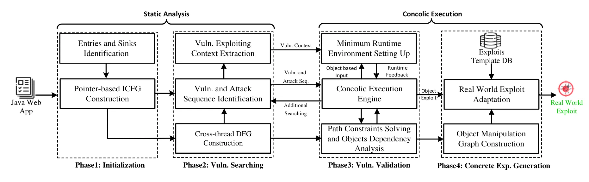

# Towards Automatic Detection and Exploitation of Java Web Application Vulnerabilities via Concolic Execution guided by Cross-thread Object Manipulation
## 论文信息
+ 论文作者：（复旦白泽）Xinyou Huang1*, Lei Zhang2*, Yongheng Liu1, Peng Deng1, Yinzhi Cao3, Yuan Zhang2, and Min Yang2
+ 发表时间：2025
+ 发表期刊/会议：USENIX
+ 阅读时间：2025.09.09，第二次细读记录

## 论文内容简述
论文核心是提出了一个JAEX模型，用于实现java漏洞的自动化检测，特别是涉及跨线程数据流的漏洞，并能够自动化生成利用流程。

## 论文创新核心
论文关注的方法部分解决了目前没啥人做过的java跨数据流安全问题，并实现了漏洞的自动化检测与利用。作者叙述了领域内其他编程语言中的跨线程数据流漏洞检测的工作，说明了其在 java 漏洞检测上的不适用性。实验部分JAEX 可以自动化检测和生成攻击载荷，效果显著。

## 论文重点部分记录

上图为 JAEX 整体结构，主要分为两个大的阶段，stage1 为静态分析，stage2 为concolic 执行部分。每个大阶段分为两个小阶段。

### Stage-1
在这一阶段，JAEX检测到潜在的漏洞，并提取执行concolic执行所需的信息。

#### Phase-1 基于指针的 ICFG 构造
JAEX对表示漏洞的源和汇API进行建模和识别。这里的一个障碍是，Java Web应用通常包含大量的抽象类型对象(例如,使用依赖注入来声明Java对象)，JAEX很难获得应用的完整控制流图( CFG )，导致源/接收器识别的假阴性较高。因此，作者提出了一种基于指针的ICFG，通过使用指向分析来加强控制流图的构建。

考虑到java 语言的复杂性，其原始 CFG 可能过于复杂和并不能真实表示出细致的代码信息，因此作者基于Anderson的指针分析算法实现了基于指针的 CFG-ICFG。

图中包括两种 entry：

    1. 常规的Web入口点，包括从主流Web应用框架中提取的处理HTTP请求映射对象的方法，如Servlet的doGet方法。
    2. 线程入口点，包括Java内置的线程机制(例如, Thread.run)以及第三方框架和库提供的异步通信API。

如上表所示，JAEX通过分析五种主要的Web框架，包括Spring、Struts2、Servlet、JAX RS和JAX WS，利用17种模式来识别这些表项。给定一个Java Web应用程序，JAEX会遍历它的所有类，并通过匹配这些模式来提取相应的Web条目。值得注意的是，为了识别线程入口点，JAEX还对控制流图( Control Flow Graph，ICFG )进行控制流分析，以确定线程入口方法是否被调用或是否作为背景线程(例如无限循环中的方法)运行。

目标识别。对于代码目标点，为了使JAEX尽可能通用，作者收集了超过500个危险方法( (例如,命令执行方法、Runtime.exec () )以及几个框架级别的危险方法模式( (例如, Mybatis等ORM框架中用户自定义的SQL API) )。JAEX将这些方法在整个应用程序中的调用站点标识为汇，用于后续分析。

#### Phase-2 漏洞检测和攻击流顺序识别
在阶段2中，JAEX识别共享对象并构建跨线程数据流图( DFG )来连接跨不同线程的源和目标。具体来说，JAEX使用一个目标引导的、按需的迭代算法来搜索DFG，并检测sink的参数是否可以被用户输入所污染。一旦识别出脆弱的数据流，JAEX进一步从CFG中提取执行路径。然后，通过识别共享对象(例如,在读API之前必须执行一个写API)的API操作序列，推断Web入口调用序列。最后，为了指导concolic执行，JAEX将进一步提取所需的代码上下文，并通过识别不同线程之间的条目、sink和共享对象来初始化必要的信息。

JAEX首先构造了一个跨线程的数据流程图( DFG )，代表潜在的跨线程数据流信息，以方便漏洞检测。然后，它使用目标代码点引导的、按需的和迭代的算法来搜索漏洞，并推断触发漏洞所需的请求序列。

一个观察是，跨线程的数据流是由线程之间的共享对象连接的。基于此，作者的关键见解是，这些共享对象通常在程序运行的整个生命周期中都是持久化的，那些具有跨线程数据交互的对象总是通过特定的API进行读写操作的访问。因此，通过将这些持久化对象识别为潜在的共享对象，以及这些对象是否跨不同线程读写，可以揭示潜在的线程间数据流关系。具体来说，JAEX识别了四种跨线程数据流机制，并将它们作为模式来识别共享对象和相关的访问操作，并连接跨线程数据流：

1. 全局变量访问
2. 数据库操作相关
3. 文件操作相关
4. 异步通信

攻击顺序流识别过程为目标代码点（污点）驱动，JAEX 首先根据污点集合初始化一批短的攻击流，然后迭代的扩增攻击路径，具体地，只有当当前路径中无受外部代码影响和操纵的变量时，认为完整的攻击路径已经发现，否则将满足上述条件的变量认为是污点变量，进一步扩增攻击路径，这个过程中，JAEX 记录攻击流顺序和用于触发的参数信息。

### Stage-2
在这个阶段，JAEX对静态分析检测到的可能存在的漏洞进行验证，并为其生成利用脚本。

#### Phase-3 通过混合执行验证漏洞有效性
JAEX首先设置了对每个潜在漏洞进行concolic测试所需要的最小运行环境。之后，JAEX会根据静态分析提取的信息生成初始输入，并将其传递给相应的入口方法，用于驱动concolic执行在执行过程中，JAEX通过插桩收集执行路径上的约束，并进行求解，以帮助执行引擎生成下一个输入。此外，如果在此过程中发现任何条件语句不受当前输入的影响，则动静结合引擎将这些信息反馈到静态分析阶段，以改进路径搜索。

**混合执行的变量定义。**为了在执行(例如,某个变量从哪里来,它遇到了哪些操作)时准确跟踪用户输入，JAEX将动静结合变量定义为四元组：(类型、值、源、描述)。类型表示变量的数据类型。值是变量在运行时的具体值。源表示变量的来源，如方法和来自(正式定义见附录B)的参数。符号表达式包含了变量在运行时执行过程中遇到的路径约束。对于复杂的对象，JAEX 嵌套地定义其类型，最终落到 java 基本对象上。

**混合执行的操作。**在混合执行过程中，不同的变量相互作用，JAEX 中定义了如下操作：

+ 正则运算符，加减乘除等。
+ 常用操作API：参考JDK中的StringBuilder.append等方法和流行的第三方库的API，如Hutool中的StringUtil.concat等。
+ 外部资源相关的API：这些API操纵外部资源，如数据库或文件。JAEX对实际中遇到的API进行建模，并为每类外部资源维护一个全局状态。JAEX然后根据运行时状态、API调用上下文和语义返回正确的动静结合变量。例如，在数据库操作中，JAEX模拟了一个由Java对象组成的数据库(例如, MySQL)，反映了CRUD操作时的状态变化。JAEX通过调用相关API中的关键语句来捕获预期的SQL表达式和预期的返回值，这允许其理解API的完整语义。通过结合传递的参数和语义，从模拟数据库中返回特定的动静结合变量。
+ 未建模操作：对于未建模的操作，例如开发人员引入的第三方库中的方法，JAEX直接执行这些方法，将返回值封装并转化为动静结合变量。

**混合执行的按步执行策略。**JAEX采用分步执行的策略进行协同执行。它遵循我们静态分析推断出的web entry调用序列，构造必要的方法参数，并调用相应的方法。每个web表项的执行由指导符号引导，这些指导符号是在静态分析过程中确定的控制变量，必须受到当前web表项的影响，以满足由另一个web表项触发的执行路径中的某些路径约束。

**约束和对象依赖分析。**在执行过程中，JAEX可能会发现一些条件语句应该包含动静结合变量。在这些情况下，JAEX使用约束求解器来确定它们所需的值。

#### Phase-4
JAEX针对已验证的漏洞生成漏洞利用。具体来说，它使用一个跨线程操作图( Object Manipulation Graph，COMG )来描述输入、共享对象和函数参数之间的关系，以及在执行路径上应该满足的约束。然后，基于专家派生的利用模板和获取的COMG构建利用所需的HTTP请求序列。

**漏洞库。**作者收集了150多个真实世界的漏洞利用，并针对7类漏洞编写了37个漏洞利用模板，这些模板已在匿名的git仓库中提供，以备审查。该数据库针对同一漏洞类型的不同利用方式维护一个利用模板，允许通过替换预定义的部分来产生不同的利用结果。

**COMG 构造。**COMG是基于从concolic执行阶段检索到的约束和依赖信息构建的。JAEX将这些信息与针对特定Web框架的HTTP请求和Java对象漏洞利用之间的预先建模的映射结合起来，最终得到这种表示生成具体漏洞利用所需核心元素的数据结构。COMG提供了以下五种类型的信息：

1. Http描述。将HTTP请求映射到Web入口参数或运行时对象。
2. 调用顺序。指定HTTP请求发送的先后顺序。
3. 字段依赖性。定义了跨不同请求的特定字段之间的依赖关系。
4. 有效载荷的约束。概述了请求字段必须满足的约束条件。
5. 代码目标点位置。识别可注入攻击载荷的位置。

利用COMG，JAEX将从concolic执行中获得的漏洞利用对象转换为具体的HTTP请求。最终自动化完成漏洞利用。

## 总结
## 论文pdf附件
[Towards Automatic Detection and Exploitation of Java Web Application Vulnerabilities via Concolic Execution guided by Cross-thread Object Manipulation.pdf](https://www.yuque.com/attachments/yuque/0/2025/pdf/27284222/1757385387387-13bb1e8a-cccd-4fbf-bb42-d0150302b081.pdf)

