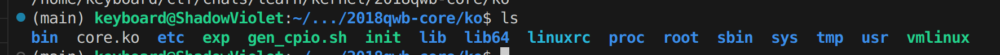

## 0x0-前言
笔者最近一个月一直在学习Linux kernel pwn的知识，读过很多入门的教学文档和其他pwner前辈的博客，感觉目前网上的资料对新人来说上手起来还是比较困难，因此本篇博客笔者重新写一篇，旨在让Linux kernel的新人快速上手，并且有一个比较清晰的学习路线，并提供一些笔者认为对初学者很有帮助的资料。
注：本篇文章默认读者具有一定的userland pwn的基础知识。

## 0x1-什么是kernel pwn
本节旨在让读者对kernel pwn在做什么有个快速的印象和了解。
有一点pwn经验的读者都熟悉userland pwn，这里被称作用户态的漏洞利用，我们的研究对象是具体有漏洞的二进制程序，在linux上即为elf程序，在攻击时，带有漏洞的二进制程序运行在靶机上，我们通过与该漏洞程序交互，通过劫持程序流等方式来改变原始程序的功能变为恶意的，比如执行一个$system("/bin/sh");$等。
- 从研究对象来看，我们的着重点在一个具体的带有漏洞的ELF程序，被攻击的是运行该程序所对应的进程，例如我们在pwntools中开出来的process。
- 从目标来看，我们的着重点在于让原始ELF程序的功能变的恶意，就是让对应的进程变为具有恶意行为的进程，而不影响靶机上运行的其他进程。
- 从调试角度看，我们在编写攻击脚本时借助gdb等工具调试，是在ELF对应的进程上调试，我们利用vmmap查看的内存地址映射关系也只是那一个进程的信息。

所谓的kernel pwn呢，最大的不同就是，我们的研究对象从原来单一的ELF程序变为了Linux内核。Linux内核很大，代码和结构体复杂，为方便选手研究，一般会给出一个有漏洞的内核扩展模块，即.ko后缀的文件，ko模块扩展了原始linux内核的功能，相当于提供给了我们一个研究范围，找漏洞只要着眼于ko文件即可。在攻击时，我们需要使用C语言编写恶意脚本，将恶意脚本编译后传入靶机，在靶机上运行实现攻击，通过劫持内核程序流来改变内核的行为为恶意的，例如执行一个$commit\_creds(\&init\_cred);$等。
- 从研究对象看，我们研究的对象从具体的ELF程序变为Linux内核，内核本质上也可以看做是一个在高权限、受约束的环境下运行的大ELF程序，其中包含大量复杂结构体信息。更具体的，在CTF中我们研究一个带有漏洞的内核扩展模块ko文件。
- 从目标来看，我们的着重点在于让Linux内核的功能变恶意，一般的目标都是实现内核提权，内核提权后受影响的为靶机上所有程序。内核提权听起来很抽象，一般来讲我们的靶机会直接给我们一个低权限的shell，我们可以在靶机上在有限的权限内随意操作，但不论怎样，我们的行为始终受到权限限制，例如，我们无法读取一个root权限保护的flag.txt文件。而内核提权在做的就是，我们编写一个C程序，用我们的低权限shell来运行该恶意程序，恶意程序运行时，会通过系统调用的方式与内核交互，具体来说，我们运行自己编写的恶意程序时，相当于用我们低权限的shell起了一个进程，这毫无疑问是用户态的，但当我们与带有漏洞的内核扩展模块交互、执行syscall等时，Linux会进入内核态，在一个高权限的环境下执行代码，内核的高权限让我们有了突破我们攻击者手里低权限shell的可能性。我们借助Linux内核本身就具有的复杂结构体、内核扩展模块的漏洞，恶意篡改内核程序流，最终让我们将内核态的高权限“继承”到用户态下。即，kernel pwn的目标是从一个低权限shell出发获取得到一个高权限的shell。
- 从调试角度来看，我们调试的是Linux内核，同样也是借助gdb、pwndbg这样的工具来调试，毕竟，linux内核也可以看作一个ELF程序。而一般，我们也不会在真机上来调试，毕竟，一旦在内核中出现错误，出现kernel panic，整个内核会直接崩掉，大大增加我们调试的成本。一般而言，我们使用qemu虚拟机来模拟一个Linux内核来调试。

## 0x2-分析过程

### 附件都给了我们啥？
相信没有学过kernel pwn的读者也大多都下载过kernel题目的附件吧，一般内核题的附件都比较大，要几十MB，附件一般包含以下几个文件：
- bzImage  --压缩过的Linux内核
- rootfs.cpio   --打包好的文件系统
- start\.sh  --启动脚本
- vmlinux   --未压缩的Linux内核，即bzImage的解包后版本

若题目没有给出我们vmlinux，我们也可以通过处理bzImage来自己生成。vmlinux和bzImage分别是未压缩和压缩后的Linux内核，这里读者可以将其抽象的看作一个很大的ELF程序。而rootfs.cpio是一个打包好的文件系统，什么是文件系统呢？可以看作是一个压缩后的Linux根目录，解包后就是一个Linux根目录的文件夹，见下图：

而start.sh就是一个环境启动脚本，一般是一个比较复杂的qemu启动命令，如下示例所示：
```bash
#!/bin/sh
qemu-system-x86_64 \
    -m 64M \
    -nographic \
    -kernel bzImage \
    -append "console=ttyS0 loglevel=3 oops=panic panic=-1 nopti nokaslr" \
    -no-reboot \
    -cpu qemu64 \
    -smp 1 \
    -monitor /dev/null \
    -initrd rootfs.cpio \
    -net nic,model=virtio \
    -net user \
    -s
```
在start.sh中定义了qemu虚拟机启动时的各种参数，具体参数含义，不在本文详细介绍，总之我们只要运行该shell脚本就能打开qemu虚拟机啦。

### 具体上手要怎么做？
#### 保护检查
在用户态题目时，我们一般拿到附件后先会使用checksec检查一下保护，那么在kernel题的时候我们也有类似的操作，checksec可以检查下vmlinux，重点看canary和pie保护。
还有一些kernel专有的保护：kaslr、kpti、smep、smap，可以看qemu启动脚本，例如上面的示例中--append参数下包含nopti、noaslr表示该启动脚本显式地关闭了这两个保护，值得一提的是，smep和smap保护在--cpu参数中添加。qemu启动脚本若没有显式说明，可以直接启动虚拟机，在虚拟机下查看：
```bash
### 查看是否开启kpti
cat /sys/devices/system/cpu/vulnerabilities/*
### 查看是否开启kaslr
cat /proc/kallsyms或者看qemu启动脚本
### 查看是否开启smep/smap
cat /proc/cpuinfo查看其中的flag字段
```

#### 解包文件系统
拿到文件系统后，可以file看一下具体格式，一般cpio的包我们直接使用cpio命令解包即可：
```bash
cpio -idmv < ./rootfs.cpio
```
如果是ext4的文件系统，那么需要我们用sudo来手动mount一下：
```bash
sudo mount -o loop ./$ROOTFS_NAME $KOPATH/
```
之后我们便获取了qemu虚拟机中真实存在的一个Linux根目录！

#### 分析虚拟机初始化脚本
上一步我们已经解包获取了qemu内的根目录，一般根目录下会有一个init启动脚本，定义了虚拟机启动时执行的内容，若根目录下没有，则去/etc/init.d下寻找，启动脚步中一般会含有一行insmod命令来加载恶意ko模块，可以根据这个特征来判断init脚本，因为init有时并不叫init哈哈哈。
init脚本内容示例如下：
```bash
#!/bin/sh

##
## Setup
##
mdev -s
mount -t proc none /proc
mkdir -p /dev/pts
mount -vt devpts -o gid=4,mode=620 none /dev/pts
chmod 666 /dev/ptmx
stty -opost
echo 2 > /proc/sys/kernel/kptr_restrict
# echo 1 > /proc/sys/kernel/dmesg_restrict

##
## Install driver
##
insmod /root/vuln.ko
mknod -m 666 /dev/holstein c `grep holstein /proc/devices | awk '{print $1;}'` 0

##
## User shell
##
echo -e "\nBoot took $(cut -d' ' -f1 /proc/uptime) seconds\n"
echo "[ Holstein v1 (LK01) - Pawnyable ]"
setsid cttyhack setuidgid 1337 sh
# setsid cttyhack setuidgid 0 sh

##
## Cleanup
##
umount /proc
poweroff -d 0 -f

```
我们这里主要关注
insmod命令，这告诉了我们内核加载的恶意模块路径在哪里，之后我们去解包好的文件系统对应目录下就能找到并复制出该ko模块来分析(ext4 mount上的文件系统需要使用root权限才能cp出来)
init脚本的其他内容笔者不做过多介绍，可参考第四部分资源推荐的各个文章来学习。

#### ko模块逆向
内核ko模块可以直接拖进IDA pro中进行逆向分析，可以把ko文件当作一个内核的扩展库文件，一般ko文件会注册为内核的一个dev或proc设备，我们通过C语言脚本中的open函数打开对应设备与其交换即可。

ko模块一般包含以下函数:
```
module_initialize  模块初始化时调用的函数，即insmod时执行的
module_cleanup 模块卸载时调用，即rmmod时执行的
module_open 模块文件打开时执行，即open时
module_close 模块文件关闭时执行，即close时
module_read 模块文件被read时执行，即read时
module_write 模块文件被write时执行，即write时
module_ioctl 模块文件被ioctl时执行，即ioctl时
```
一般重点先看module_initialize，这里定义了模块被注册成什么设备，是dev还是proc下，分析这里可以让我们知道后面与模块交互前使用open打开的文件路径是什么。
然后简单看看module_open，一般时打开时的一些初始化操作。
然后再正式开始分析其他函数，也就是ko模块的完整功能和漏洞点分析。

#### 脚本编写

在逆向ko文件后就可以准备编写攻击脚本了，脚本为C脚本，后续我们需要编译并传入靶机（远程环境通过nc连接交互传递，一般时base64来传递；本地调试将编译后的exp程序放入解包好的文件系统再重新打包即可）

脚本编写过程中要求pwn选手与漏洞模块交互，在内核态实现提权，最终落回用户态并获得一个root权限shell，之后用root的shell去cat flag即可。

#### 调试qemu
与用户态一样，甚至更困难的是kernel pwn的攻击过程也需要漫长且细致的调试，好在gdb和qemu都做支持内核的调试。
- qemu开启调试支持：qemu在启动时添加-s参数即可在本地1234端口开启调试服务
- gdb连接： 
    ```
    gdb
    target remote 127.0.0.1：1234
    ```
    即可将gdb附上qemu来调试
- 加载ko/vmlinux的符号表：加载符号表我们需要知道对应文件的基址。
    在加载ko文件时，要获取模块基址首先进入qemu
    ```bash
    cat /proc/modules
    ```
    在加载内核符号时，若未开启kaslr保护，则直接checksec获取其地址，若开启了kaslr则进入qemu
    ```bash
    grep  commit_creds  /proc/kallsyms
    ```
    先获取一个内核函数真正的地址，在借助固定偏移来计算出内核基址，这与userland的libc基址计算相同
    要加载的文件真实地址已知后，在gdb中加载符号：
    ```bash
    add-symbol-file ./vuln.ko $ko_addr
    add-symbol-file ./vmlinux $vmlinux_addr
    ```
- 下断点：在加载了符号表之后可以使用函数名也可以使用真实地址来下断点：
    ```bash
    b moudle_ioctl
    b *0xffff...
    ```
再往后的调试过程与用户态基本一致。值得一提的是，内核堆不支持heap和bins这种命令查看，内核内存映射也没有vmmap这中命令查看，毕竟这是内核，不是一个用户态进程！！！

## 0x3-学习路线

关于kernel学习路线的推荐，笔者建议有志于深入研究/挖洞/科研Liunx内核安全的选手系统性地学习前置知识，如：操作系统、linux内核组成、环级控制域等。
之后可以按如下顺序学习：
1.kernel ROP
2.kernel ROP and bypass kpti
3.ret2usr
4.bypass smep
5.pt_regs and generic ROP
6.ret2dir
7.内核堆slab分配器
8.kernel object UAF
9.kernel heap spray
10.freelist hijack
11.cross-cache overflow
12.page-level fengshui
13.cross-cache UAF
14.page-level UAF
15.userfaultfd
... real CVEs and great pwners' research/social media 
... papers from defcon/blackhat/community

## 0x4-资源推荐

本节汇总一些笔者自认为非常推荐kernel pwn新人阅读的内容以及好用的工具/资源：

- [CTFWiki](https://ctf-wiki.org/pwn/linux/kernel-mode) ，一个很权威的CTF学习wiki，关于kernel pwn的部分讲解了不少知识点，且大部分都带有例题和exp可以研究。
- [Pawnyable](https://pawnyable.cafe/linux-kernel/)，一个日本pwner写的学习课，包含10个专题，可以按这里的顺序学习，每个专题有专门例题，作者写了专门讲解，非常好。
- [Linux Pwn技巧总结_1](https://xz.aliyun.com/news/4161)，先知社区的文章，写的不错且带有几道例题。
- [一个题掌握linux内核pwn常用结构体](https://blingblingxuanxuan.github.io/2023/01/10/23-01-10-kernel-pwn-useful-struct/)，介绍了kernel pwn中重要结构体的利用和对应例题，这是新人最渴望积累也是很难获取的资源。
- [Linux Kernel Pwn all in one](https://yogdzewa.github.io/2023-02/pwn-new-pwn-kernel-basic/)，配合着CTFWiki看。
- [arttnba3's blog](https://arttnba3.cn/)，arttnba3大佬的博客，也是ctfwiki关于内核pwn部分的作者，拜读！
- [ltfa1l's blog](https://ltfa1l.top/)，ltfa1l佬的博客，拜读！
- [Linux kernel源码搜索](https://elixir.bootlin.com/linux/v6.18/source)，一个可以在线搜索查看linux 内核源码的网站，支持多版本内核源码查询。
- [笔记](http://linux.laoqinren.net/kernel/)，一份linux内核笔记，有不少值得一看的内容。

